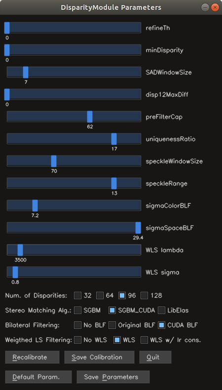

Stereo Vision
============

A C++ [YARP](https://github.com/robotology/yarp) library that provides the **iCub** robot with stereo vision capabilities.

[](https://zenhub.com)

## Installation

##### Dependencies
- [YARP](https://github.com/robotology/yarp)
- [iCub](https://github.com/robotology/icub-main)
- [icub-contrib-common](https://github.com/robotology/icub-contrib-common)
- [OpenCV](http://opencv.org/downloads.html) (**>=2.4** and with **SIFT** features available)
    1. Download `OpenCV`: `git clone https://github.com/opencv/opencv.git`.
    2. Checkout the correct branch/tag.
    3. Download the external modules: `git clone https://github.com/opencv/opencv_contrib.git`.
    4. Checkout the **same** branch/tag as above.
    5. Configure `OpenCV` by filling in **`OPENCV_EXTRA_MODULES_PATH`** with the path to `opencv_contrib/modules` and then toggling on all possible modules.
    6. Compile `OpenCV`.
- [SiftGPU](https://github.com/pitzer/SiftGPU) (optional but suggested for better performance)
- [CUDA](https://developer.nvidia.com/cuda-downloads) 

We also make use of [LIBELAS](http://www.cvlibs.net/software/libelas/) for computing disparity maps, but there is no need to download it, since it is incorporated inside this code. For more information about how we incorporate the library, please see this [README](./lib/include/iCub/stereoVision/elas/README.md).

## Documentation

Online documentation is available here: https://robotology.github.io/stereo-vision.

## Implementation Details

The main classes introduced by this repository are the following ones:

- `StereoCamera`: handles everything related to the geometry of the stereo system.
- `DisparityModule`: implements the main logic driving the computation of the disparity map, exposing the ports through which an user can obtain both the disparity and depth maps. This is the only object which interfaces itself with the (optional) graphical user interface.
- `StereoMatcherNew`: carries out the computation and post-processing operations of the disparity map, by getting the rectified images directly from the `StereoCamera` being used.

### **Handling of the Stereo Parameters**

The stereo parameters are saved within the configuration file `SFM.ini`, and are loaded and saved at runtime. In case the parameters are not available in the configuration file (as in the case you run this new module on a PC for the first time), the usual default values are loaded.

### **Use of the Module with 640x480 images**

The module expects 320x240 images by default. It can be used with 640x480 images by invoking it with the `--use640` flag.

### **GUI**

This repository comes with a [GUI](https://github.com/Dovyski/cvui) which helps the user during the fine-tuning of the parameters of this module. 

The components (and the code related to) the GUI can be disabled by means of a toggle in the CMake configuration, named `USE_DISPARITYMODULE_GUI`. Disabling it, takes away the single header file representing the GUI base code, together with all the other bits of source related to it. Thus, compiling the module without the GUI included actually removes everything about it from the final result.

<p align="center">
  
</p>

The GUI makes it now easier to recalibrate the stereo system, to save the calibration, to load default stereo parameters and to save the current ones. Once it is not useful anymore, it can be quitted, closing it for the rest of the execution.

When compiled with GUI functionalities, the module can be launched with the graphical interface by invoking it with the flag `--gui`.

### **Inserting a novel stereo matching algorithm**

It is possible to add a new stereo matching method by editing the content of just a few files. These are the steps to follow:

1. file `StereoMatcher.h`:

   - add a new function definition to be associated with the new matching method, i.e.:
   ```cpp
   void matchMethodX();

   ```

   - add a new item to the [enumeration](./modules/DisparityModule/StereoMatcher.h#L27) used to represent the different matching algorithms available:

   ```cpp
   enum SM_MATCHING_ALG {
       SGBM_OPENCV = 0,
       SGBM_CUDA,
       LIBELAS,
       METHODX
   };
   ```

2. file `StereoMatcher.cpp`:

   - implement the corresponding matching method, which might also rely on external libraries, or have additional dependencies (which handling is not described here, since it's specific to the new algorithm included):

   ```cpp
   void StereoMatcherNew::matchMethodX()
   {
     [...]
     // code executing the matching
     [...]
     this->disparity16 = resulting_disparity;
   }

   ```

3. file `DisparityModule.cpp`:

   - enrich the content of [line 246](./modules/DisparityModule/DispModule.cpp#L246), with the new algorithm available, adding a new **keyword** to select it at configuration time:

   ```cpp
   if (rf.check("sgbm"))
      this->stereo_matching = SM_MATCHING_ALG::SGBM_OPENCV;
   [...]
   else if(rf.check("methodX"))
      this->stereo_matching = SM_MATCHING_ALG::METHODX;
   ```

4. file `StereoMatcher.cpp`:

   - add the handling of the new matching algorithm in the [`switch`](./modules/DisparityModule/StereoMatcher.cpp#L67) within the `StereoMatcherNew::compute()` function:

   ```cpp
   case SM_MATCHING_ALG::METHODX:
      this->matchMethodX();
      break;
   ```

The following additional step is optional, and meant to be considered only if you plan to use this module with also the GUI functionalities:

5. (optional) file `cvgui.cpp`:

   - add a new checkbox to the radioButtons call at [line 114](./modules/DisparityModule/cvgui.cpp#L114):

   ```cpp
   this->updated |= cvuimine::radioButtons(frame, "Stereo Matching Alg.:", {"SGBM", "SGBM_CUDA", "LibElas", "MethodX"}, {20, 90, 190, 260}, 0);
   ```

   **NOTE**: you might want to enlarge the GUI window, since now there are more options in the radio buttons group associated with the choice of the stereo matching algorithm, this can be done by changing [line 60](./modules/DisparityModule/cvgui.cpp#L60) of the file:

   ```cpp
   int gui_width = 450;   
   ```

   the value 450 is the one specified for the width, when initially designed. Increasing this value will make the window a little bigger, correctly fitting your needs.

   - adding the new algorithm to the `switch` construct in `GUI::convertIDTOEnum()`:

   ```cpp
   switch(this->stereo_matching_id)
   {
       [...]
       case 3:
           this->params.stereo_matching = SM_MATCHING_ALG::METHODX;
           break;
   }
   ```

   - adding the new algorithm to the `switch` construct in `GUI::convertEnumToID()`:

   ```cpp
   switch(this->params.stereo_matching)
   {
       [...]
       case SM_MATCHING_ALG::METHODX:
           this->stereo_matching_id = 3;
           break;
   }
   ```

### **Known (negligible) issues**

A few things are not complete (however, they don't compromise the functionality of the module), and still require a quick correction each one:

   1. the implementation of the left-right consistency for the WLS filtering
   2. saving and loading the disparity map refinement threshold from the configuration file
   3. the original bilateral filtering is not working as supposed, since when the code has been moved on the iCub PC, the filtering is run but it looks like that the sigmaColor and sigmaSpace parameters are ignored. This is not critical at all, since that filtering process is very slow, and it can be substituted with the CUDA implementation of the bilateral filtering, which is now available. however this issue should be fixed at some point


## License

The files contained in this repository are licensed under the [GNU General Public License v2.0 later](http://www.gnu.org/licenses/gpl.html) (see the file [LICENSE](./LICENSE) for details), except the following files:
- files from the [LIBELAS](http://www.cvlibs.net/software/libelas/) library which have been incorporated into this code: see this [README](./lib/include/iCub/stereoVision/elas/README.md) for the specification of which files
